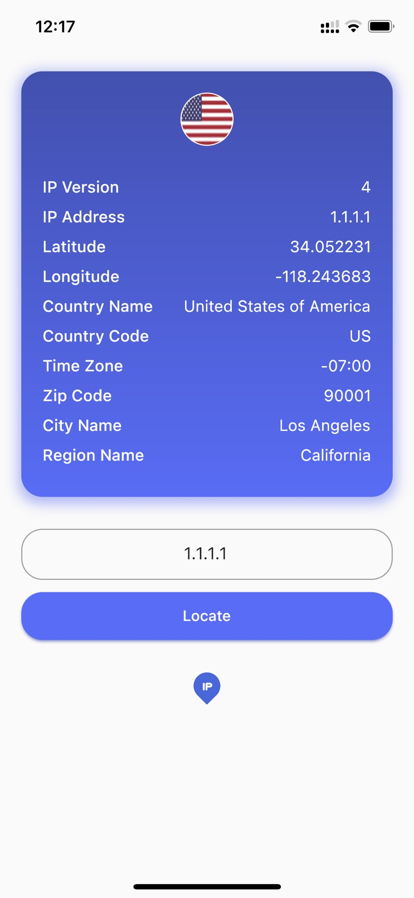
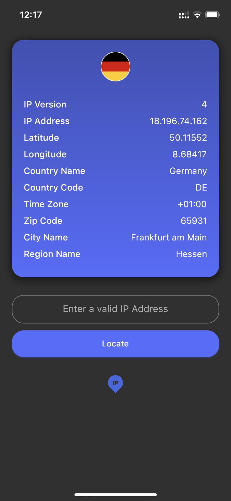

# IP2Location

My first Flutter app

  
   
  

## About the app

IP2Location is a simple mobile application for getting information about your device's IP address or any other IP address.

## Under the hood

This application is using a free IP API (freeipapi.com) for gathering informations about the IPs.

## Architecture

I've used the Clean Architecture to develop this app.

**Attention:** Using complicated architectures for small apps is not recommended! This app is a practice :)

## Any advice?

I developed this app in my first-day learning Flutter! I may have done so many things wrong! So, Please let me know what I've done wrong so I can learn from my mistakes.

Thank you 